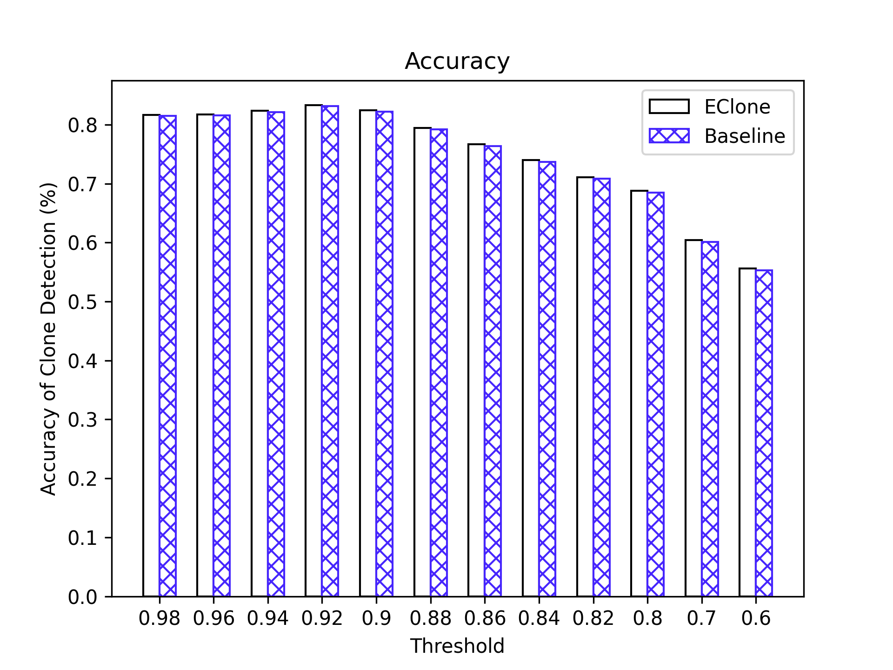
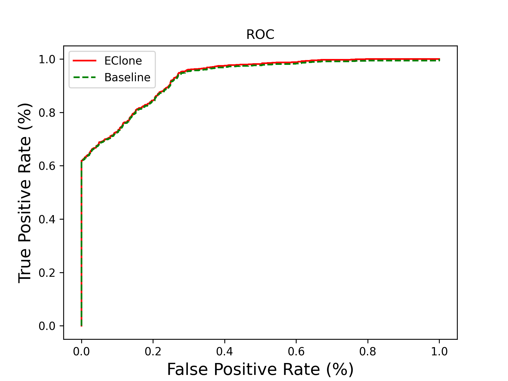

Reproduction of [Enabling Clone Detection For Ethereum via Smart Contract Birthmarks](https://ieeexplore.ieee.org/document/8813297) to compute similarity of bytecode.

# Test

There are two ways to test the similarity (The first one require the [`evm`](https://geth.ethereum.org/docs/getting-started/installing-geth) in the operating environment):

1. Two bytecode file input
2. One Address input (in dataset): Similarity of two bytecode compiled with/without --optimize
3. Two opcode file input (in dataset): Similarity of two bytecode (input of disassembler)

There are three ways to trigger the test process in `test.py`:

1. `single_test(bytecode1, bytecode2)`: output the result of similar or not.
2. `batch_test(address_list)`: output the result of accuracy of this address_list.
3. `test_by_file(opcode_file1, opcode_file2)`: output the result of similarity from two opcode file.

# Result

## Accuracy

The best threshold is 0.92.

## ROC

